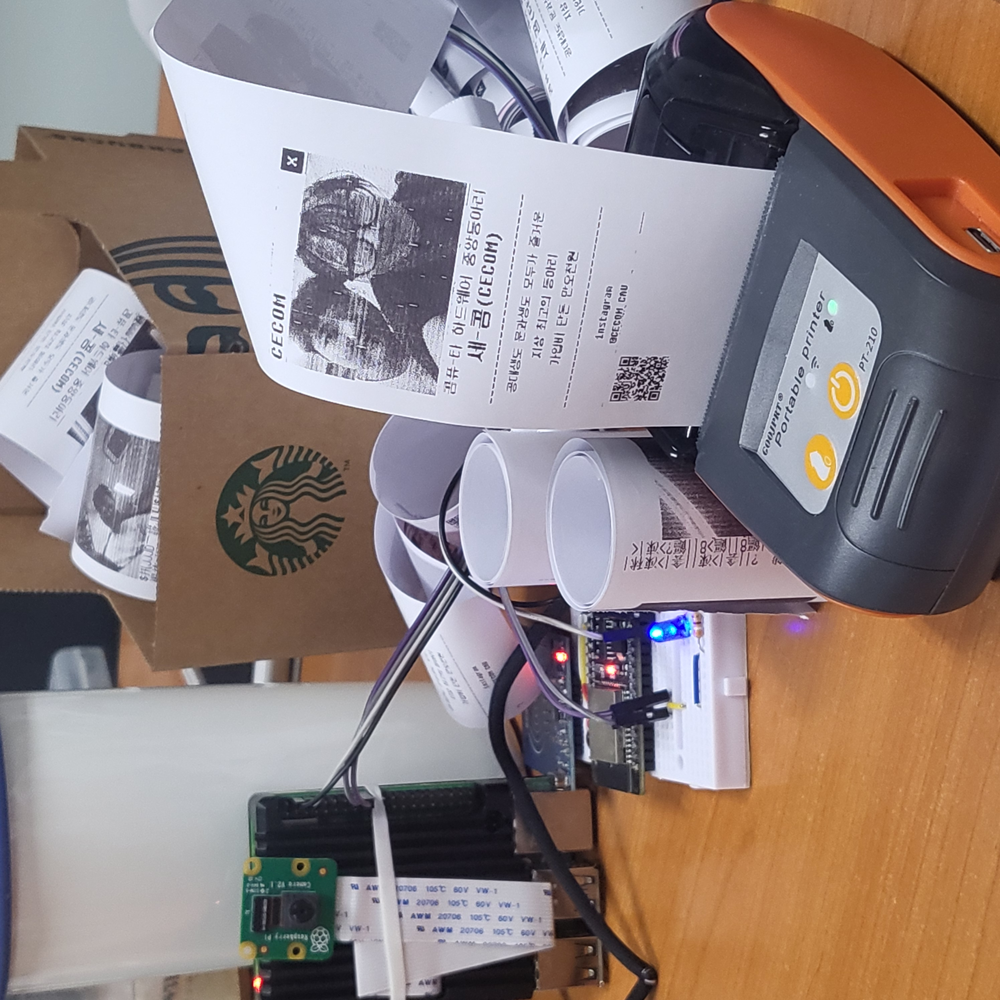
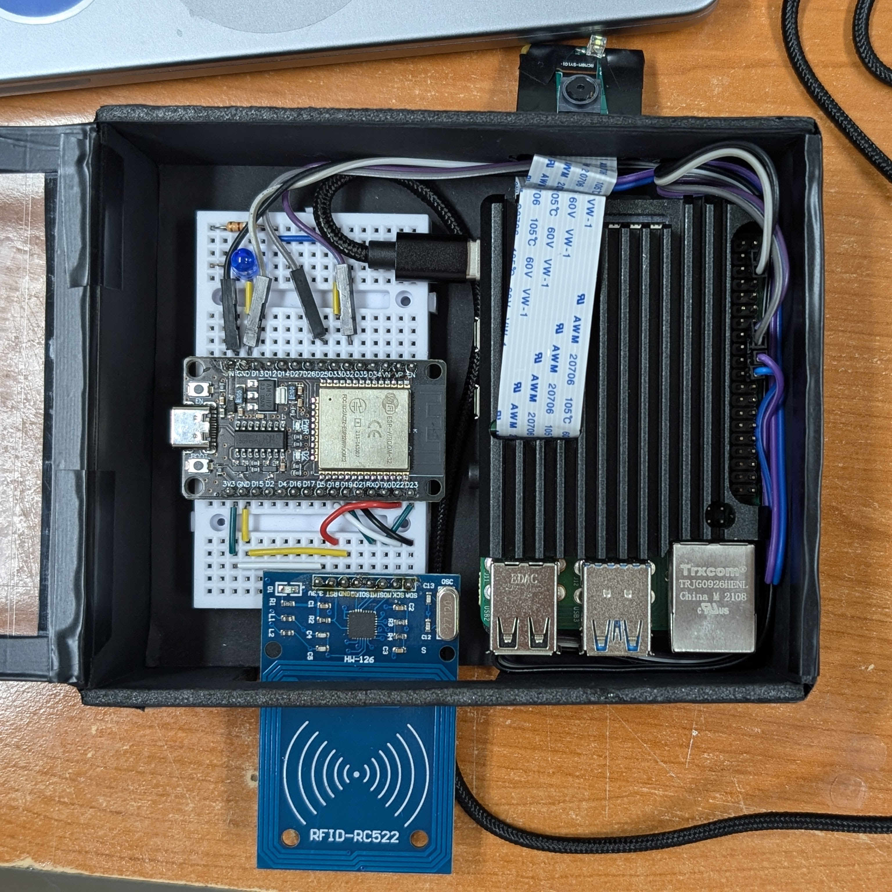

# Project CECOM4CUT

영수증프린터와 연동한 사진부스 프로젝트입니다. 
RPI4 기반의 카메라 모듈을 이용해 사진을 촬영하고, 이를 영수증프린터로 출력하며, 웹서버로 전송해 원본 파일을 다운받을 수 있습니다.

## Project Structure
### Scripts
__cecom4cut_main.sh__ : 사진 촬영과 처리, 출력의 과정을 각각 수행하는 하단의 `Runners` 스크립트를 순차적으로 연속해 실행합니다. 
__cecom4cut_reprint.sh__ : GATT 전송 과정에서 발생하는 버퍼 실패 문제로 출력이 잘못된 경우, 마지막에 촬영한 사진을 재출력하는 스크립트입니다. 

### Runners
__GPIO_Manager__ : RPI의 GPIO 핀을 통해 사진 촬영 트리거 신호를 전달받습니다. 이후, LED를 3회 깜빡인 뒤 사진 촬영 스크립트가 실행됩니다. 
__Image_Capture__ : RPI의 카메라 모듈을 이용해 사진을 촬영합니다. 
__Image_Processing__ : 촬영된 이미지를 출력하기 위한 처리를 진행합니다. Python PIL 라이브러리를 기반으로 디더링을 수행하고, 해상도를 조정합니다. 
__Image_QR__ : 촬영된 이미지를 다운로드할 수 있는 URL 정보를 QR코드 이미지로 변환합니다. Python QR 라이브러리를 기반으로 동작합니다. 
__Print_Scripts__ : BLE GATT를 통해 프린터로 사진 버퍼를 전송합니다. 상단 프레임, 촬영 이미지, 하단 프레임, QR코드를 순차적으로 전송합니다. 

### Utils
__Systemd_scripts__ : `cecom4cut_main.sh` 스크립트를 트리거를 통해 호출하기 위해 Systemd 서비스를 등록하는 스크립트입니다.
__set_printer_mac.sh__ : `PT-210` 프린터를 탐색하고, 이를 시스템 환경변수에 등록하기 위한 스크립트입니다.

## Teams

| [유용민](https://github.com/yymin1022) | [서유빈](https://github.com/viiniu) |
| --- | --- |
|  |  |
| RPI 스크립트 개발 | ESP32 기반 Trigger 개발 |
| 소프트웨어학부 "19 | 전자전기공학부 "22 |

## Project Example

  </img>
  </img>

